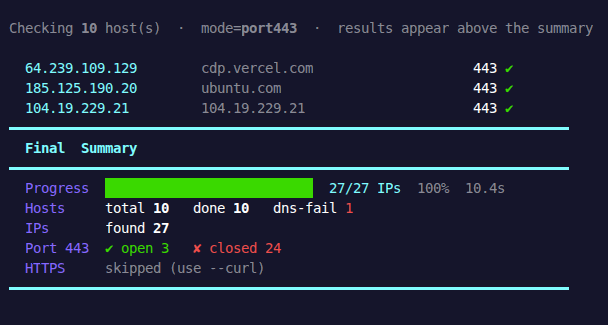

<div align="ltr">

# 🔍 netprober

**Concurrent Host/IP Prober with custom DNS resolution, port scanning, ping and curl support**



## ✨ Features

- **Live terminal summary** — progress bar, stats, and per-IP results update in real time
- **CIDR expansion** — sweep entire subnets like `10.0.0.0/24` natively
- **Concurrent probing** — tunable worker pool, non-blocking by default
- **Multiple check modes** — multi port, ICMP ,ping, and HTTPS curl independently toggled
- **Structured output** — results written to separate files as they land, no waiting
- **Support ip v4&v6**
- **Detect Providers**

---

## 📦 Installation

### Via npm / pnpm / bun (global CLI)

```bash
# npm
npm install -g netprober

# pnpm
pnpm add -g netprober

# bun
bun add -g netprober
```

Then use it anywhere:

```bash
netprober --help
```

---

### Run directly with Bun

> Requires [Bun](https://bun.sh) — install it first

```bash
git clone https://github.com/maanimis/netprober
cd netprober
bun ./src/index.ts --help
```

---

### Download prebuilt binary

A standalone binary is available for **Linux x86-64 (amd64)** — no Node, no Bun required.

1. Head to the [**Releases**](https://github.com/maanimis/netprober/releases) page
2. Download `netprober-linux-amd64`
3. Make it executable and run:

```bash
chmod +x netprober-linux-amd64
./netprober-linux-amd64 --help
```

> ⚠️ Only `linux/amd64` is currently available as a prebuilt binary. For other platforms, use the npm package or run with Bun directly.

---

## 🚀 Usage

```bash
netprober [options]
```

### Flags

| Flag                    | Description                      | Default          |
| ----------------------- | -------------------------------- | ---------------- |
| `-i, --input <file>`    | Input hosts file                 | `hosts.txt`      |
| `--output-ping <file>`  | Ping-up IPs output file          | `ping_up.txt`    |
| `--output-ports <file>` | Open ports IPs output file       | `ports_open.txt` |
| `-r, --resolver <ip>`   | DNS resolver to use              | `127.0.0.1`      |
| `-c, --concurrency <n>` | Concurrent workers               | `10`             |
| `-t, --timeout <s>`     | Per-check timeout in seconds     | `5`              |
| `--ping-count <n>`      | ICMP ping packet count           | `3`              |
| `--ping`                | Enable ICMP ping checks          | `false`          |
| `--curl`                | Enable HTTPS curl checks         | `false`          |
| `-v, --verbose`         | Show all IPs, not just live ones | `false`          |
| `-p, --ports`           | ports (e.g. 80,443,8000-8100)    | `443`            |

---

## 📋 Input Format

Create a `hosts.txt` file — one host, IP, or CIDR range per line:

```
example.com
api.example.com
192.168.1.0/24
10.0.0.1
https://target.com/path   ← URLs are sanitized automatically
```

---

## ⚡ Examples

```bash
# Basic — port 443(default) probe only
netprober -i hosts.txt

# Scan with multiport
netprober -i hosts.txt -p 443,8080,80,2080,2053

# Also can use range for ports(from 80 to 90)
netprober -i hosts.txt -p 80-90

# With ping + curl, using Google's DNS, 25 workers
netprober --ping --curl -r 8.8.8.8 -c 25

# Verbose output — show every IP, not just live ones
netprober -v --curl -t 3

# Sweep a CIDR range with curl enabled
netprober -i ranges.txt --curl -c 50

# Custom output files
netprober -i targets.txt -o live.txt --output-ports open_ports.txt
```

---

## 📁 Output Files

| File             | Contents                                          |
| ---------------- | ------------------------------------------------- |
| `ping_up.txt`    | IPs responding to ICMP ping _(requires `--ping`)_ |
| `ports_open.txt` | IPs with open ports                               |

All files are written **in real time** as results come in — no waiting for the run to finish.

---

## 📄 License

MIT © [maanimis](https://github.com/maanimis)
